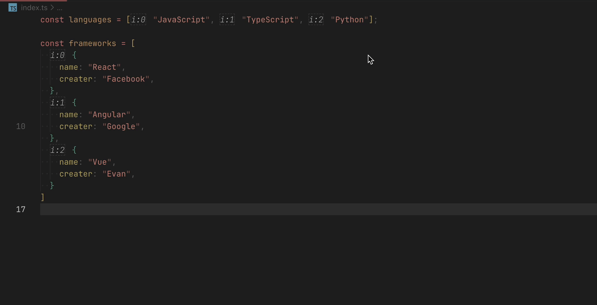
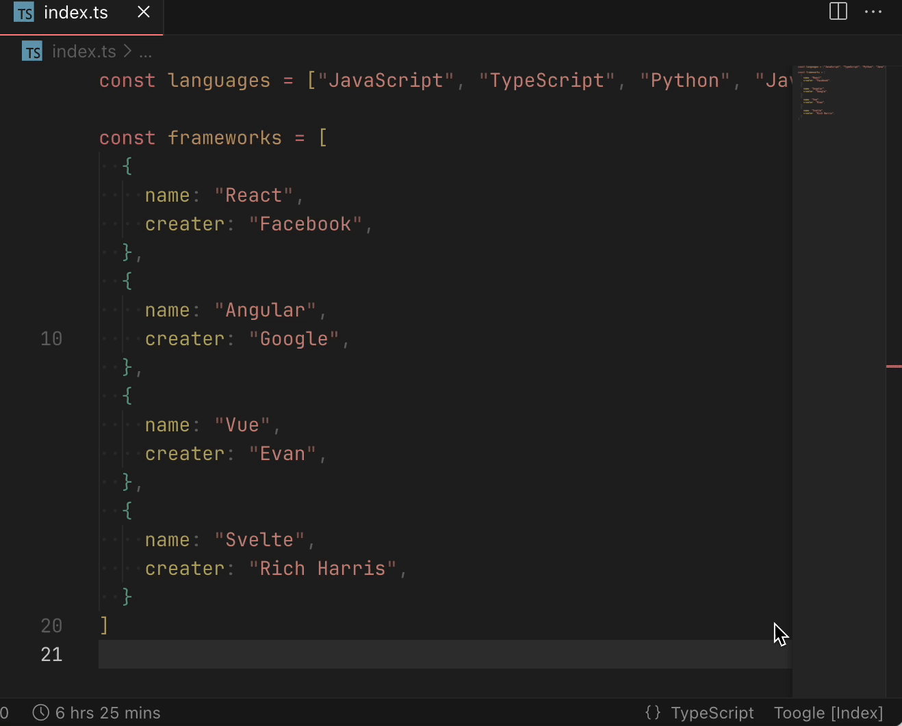

# VSCode Array Index

> Show array index in editor.

<a href="https://marketplace.visualstudio.com/items?itemName=yuyinws.vscode-array-index" target="__blank"></a>



## Status Bar



## Command

1. <kbd>Cmd/Ctrl</kbd> + <kbd>shift</kbd> + <kbd>P</kbd>
2. Toggle Array Index

## Configuration

```json
{
  "vscode-array-index.isShowInLoad": false
}
```

> whether show array index when editor load.

## Support Language

Now support `.js(x)` `.ts(x)` `.vue` `.svelte` and `.json`.

PR and issue welcome for more language support.
